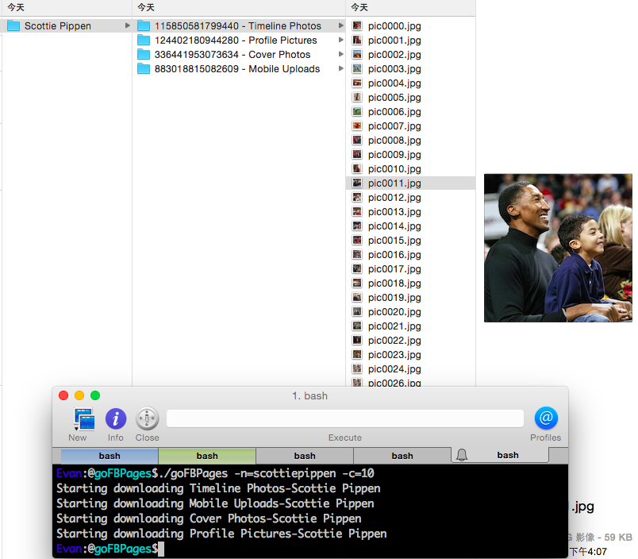

goFBPages
======================

A facebook page photo album tool that supports concurrency download. This tool help you to download those photos for your backup, all the photos still own by original creator.

Install
--------------

    go get -u -x github.com/kkdai/goFBPages

Note, you need go to [faceook developer page](https://developers.facebook.com/tools/explorer?method=GET&path=me) to get latest token and update in environment variables.

     export FBTOKEN = "YOUR_TOKEN_HERE"

Usage
---------------------

    goFBPages [options] 

All the photos will download to `USERS/Pictures/goFBPages` and it will separate folder by page name and album name.

Options
---------------

- `-n` Facebook page name such as: [scottiepippen](https://www.facebook.com/scottiepippen), or input facebook id if you know such as 112743018776863 
- `-c` number of workers. (concurrency), default workers is "2"

Examples
---------------

Download all photos from Scottie Pippen facebook pages with 10 workers.

  goFBPages -n=scottiepippen -c=10

Snapshot
---------------

TODOs
---------------

- Support specific album download.
- Support firend/self album download for backup.
- Support CLI to select which album you want to download.

Inspired
---------------

This project inspired from [https://github.com/tzangms/iloveck101](https://github.com/tzangms/iloveck101). And I refer those implements as follow:

- Facebook graph API by Go: [https://github.com/huandu/facebook](https://github.com/huandu/facebook)
- Photo download: [https://github.com/lazywei/iloveck101](https://github.com/lazywei/iloveck101)

Contribute
---------------

Please open up an issue on GitHub before you put a lot efforts on pull request.
The code submitting to PR must be filtered with `gofmt`

Related Project
---------------

An Instagram photo downloader also here. [https://github.com/kkdai/goInstagramDownloader](https://github.com/kkdai/goInstagramDownloader)

Advertising
---------------

If you want to browse facebook page on your iPhone, why not check my App here :p [粉絲相簿](https://itunes.apple.com/tw/app/fen-si-xiang-bu/id839324997?l=zh&mt=8)

License
---------------

This package is licensed under MIT license. See LICENSE for details.
